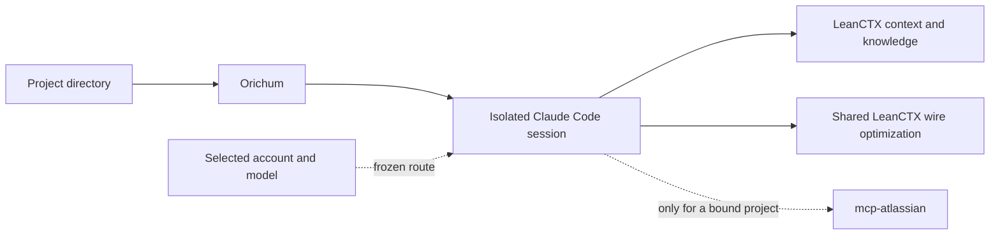

# Orichum

**Pronounced:** *OR-ih-kum*, following *orichalcum*.

[](LICENSE)

> Run Claude Code with the models, accounts, project tools, memory, and
> specialist agents that fit each project.

Orichum is an independent harness for Claude Code. You continue working inside
Claude Code while Orichum prepares the right model stack, provider account,
project context, and optional tools for the directory you launched from.

Once setup is complete, daily use is simply:

```bash
cd ~/projects/my-app
orichum
```

## What Orichum does

- Runs GPT, Claude, Google, Kimi, and other configured models inside the
  familiar Claude Code interface.
- Lets you choose models and named provider accounts while handling safe
  same-family account recovery automatically.
- Loads the right GitHub identity, project tools, memory, and code graph from
  the directory where you start it.
- Keeps concurrent and resumed sessions isolated, while the controller chooses
  relevant context and specialist agents for each task.

You do not need to understand the routing architecture before using Orichum.
Start with one provider and one project; add the other capabilities only when
you need them.

## Install

Orichum supports macOS, Linux with a systemd user manager, and WSL2 with
systemd enabled.

```bash
git clone https://github.com/orichum/orichum.git
cd orichum
./install.sh
```

The first install performs the complete setup. When a provider route is
available, it also finishes with the full health check. Without one, it
completes in `pending-provider-login` state and prints the next login command.
Orichum installs its runtime and all user-managed state under `~/.orichum`;
the checkout remains source code only, so editing configuration never dirties
the repository and moving the checkout does not break the installed command.
Later `./install.sh` runs quickly when everything is already verified and
healthy. Use `./install.sh --upgrade` when you want Orichum to check upstream
releases, upgrade managed tools, and run their complete probes; the full doctor
check follows once a provider route is available. See
[Installation and upgrades](docs/installation.md) for details, locations, port
handling, and uninstall options.

Check the installed Orichum release with `orichum --version`. See the
[Changelog](CHANGELOG.md) for release history and current release-candidate
limitations.

To remove the Orichum runtime while keeping accounts, sessions, project
configuration, and LeanCTX project knowledge for a later reinstall:

```bash
./install.sh --uninstall
```

Use `./install.sh --uninstall --purge` only when you also want to permanently
remove Orichum's saved configuration and data.

## Your first Orichum session

This walkthrough creates the smallest useful setup: one provider, one named
account, one model stack, and one project.

### 1. Connect one provider account

Start the provider wizard:

```bash
orichum provider configure
```

Choose the provider, complete its CLIProxyAPI login, then name the account and
select its pool and priority. Orichum detects the new private credential and
registers it without asking you to find or copy a credential filename.

Confirm that the account is active:

```bash
orichum provider accounts
```

See [Providers and accounts](docs/providers-and-accounts.md) for other
providers and account-management commands.

### 2. Create a model stack

A stack assigns live models to the main controller and optional specialist
roles. Start the interactive wizard:

```bash
orichum stack configure
```

The wizard lists the models currently available through your registered
accounts. Choose a controller model, accept or change the specialist choices,
review the result, and save the stack.

Inspect saved stacks with:

```bash
orichum stack list
orichum stack show STACK
```

See [Model stacks](docs/model-stacks.md) for provider locks, account policies,
and role behavior.

### 3. Add a project

A context tells Orichum which settings belong to a parent directory and every
repository below it. This example adds `~/projects` using the shared account
pool:

```bash
orichum context add ~/projects --pool shared
```

This saves the directory mapping immediately. LeanCTX builds source,
relationship, and project-knowledge context only when the session needs it;
there is no mining or population step.

Jira is optional. Configure it only for a project that needs Atlassian:

```bash
orichum context jira ~/projects
```

The command stores the Jira URL, username, and token directly on that private
project entry. New sessions below the root receive a dedicated
`mcp-atlassian` process; projects without a binding load no Atlassian tools.

Check the configured directory mappings:

```bash
orichum context list
```

See [Project contexts](docs/project-contexts.md) for GitHub identities,
multiple parent directories, repository discovery, and context maintenance.

### 4. Start Orichum

Enter a repository below the configured parent and launch:

```bash
cd ~/projects/my-app
orichum
```

Orichum resolves the project, prepares an isolated session with the selected
model, account, and relevant tools, then opens Claude Code. From this point,
work normally; the controller decides when project context or a configured
specialist is useful.

The Orichum status line keeps the active model, named account, route state,
context usage, and available provider limits visible. See
[Status line](docs/status-line.md).

If launch fails, start with:

```bash
orichum doctor
```

## Daily use

| What you want to do | Command |
|---|---|
| Start in the current project | `orichum` |
| Check project mappings | `orichum context list` |
| Configure project Jira | `orichum context jira ROOT` |
| Remove project Jira | `orichum context jira ROOT --remove` |
| List or inspect stacks | `orichum stack list` / `orichum stack show STACK` |
| Check named accounts | `orichum provider accounts` |
| List sessions | `orichum sessions` |
| Inspect a session's live status | `orichum status SESSION_ID` |
| Inspect a session's routes | `orichum session routes SESSION_ID` |
| Resume a session | `orichum resume SESSION_ID` |
| Remove one session from Orichum | `orichum sessions remove SESSION_ID` |
| Clear inactive sessions from Orichum | `orichum sessions clear` |
| Monitor context savings | `orichum leanctx stats`, `orichum leanctx watch`, or `orichum leanctx dashboard` |
| Check the installation | `orichum doctor` |
| Show the active home, config, cache, and state paths | `orichum config paths` |
| Upgrade Orichum | Run `./install.sh --upgrade` from the Orichum checkout |

The complete command map is in the [CLI reference](docs/cli-reference.md).

## Add capabilities when you need them

- **More accounts:** register additional credentials, name them, and set
  priorities for new-session selection and same-family recovery. See
  [Multi-account routing](docs/multi-account-usage.md).
- **More model families:** authenticate another provider and use
  `orichum stack configure` to add its live models. See
  [Model stacks](docs/model-stacks.md).
- **Resumes and family changes:** resume a frozen session or fork it with a
  bounded handoff onto another stack. See [Sessions](docs/sessions.md).
- **Memory and code intelligence:** LeanCTX recalls durable decisions, reads
  live source, and answers structural or impact questions. See
  [Memory and code graph](docs/memory-and-code-graph.md).
- **Live source context:** LeanCTX gives the controller compact reads, search,
  trees, lossless expansion, approved text patches, and compressed output from
  arbitrary finite CLIs. Specialists reuse the same jailed context engine
  instead of falling back to raw repository reads. A shared LeanCTX wire proxy
  also trims growing conversation history before each request reaches the
  provider.
  See [LeanCTX](docs/leanctx.md).
- **Plugins:** declare and synchronize optional Claude Code plugins through
  Orichum. See [Plugins](docs/plugins.md).
- **Jira:** configure private Jira credentials on a project root. Orichum loads
  `mcp-atlassian` only for sessions below that root. See
  [MCP integrations](docs/mcp-integrations.md).
- **Specialist agents:** let the controller delegate bounded exploration,
  review, architecture, or implementation work while keeping one writer. See
  [Subagents](docs/subagents.md).

## How Orichum fits together



The directory where you run `orichum` selects the project configuration.
Orichum opens a private session using the chosen model and account, then makes
only the relevant project context available. You do not select a tool profile
or manually route each request.

Read [Architecture](docs/architecture.md) for service ownership, security
boundaries, session isolation, and the internal request path.

## If something is wrong

Run the bounded health check first:

```bash
orichum doctor
```

Then inspect the part of the setup involved:

```bash
orichum config paths
orichum provider accounts
orichum stack list
orichum context list
orichum sessions
orichum leanctx stats
```

The [Troubleshooting guide](docs/troubleshooting.md) covers unavailable routes,
connection failures, GitHub identity, missing MCPs, LeanCTX activity,
historical session contracts, and installer port conflicts.

## Documentation

| Guide | Use it for |
|---|---|
| [Installation and upgrades](docs/installation.md) | Platforms, prerequisites, locations, ports, services, and upgrades |
| [Providers and accounts](docs/providers-and-accounts.md) | Login, credentials, account names, pools, and priorities |
| [Multi-account routing](docs/multi-account-usage.md) | Multiple accounts from the same or different providers |
| [Model stacks](docs/model-stacks.md) | Interactive model selection, roles, and provider locks |
| [Project contexts](docs/project-contexts.md) | Directory mappings, identities, account pools, and Jira bindings |
| [Sessions](docs/sessions.md) | Start, inspect, resume, fork, and concurrent sessions |
| [Status line](docs/status-line.md) | Active model, account, failover state, context, and quota metrics |
| [Routing and failover](docs/routing-and-failover.md) | Route selection, cooldowns, rollover, and handoff boundaries |
| [Subagents](docs/subagents.md) | Automatic delegation, specialist roles, and the sole-writer policy |
| [Plugins](docs/plugins.md) | Add, update, synchronize, inspect, and remove plugins |
| [MCP integrations](docs/mcp-integrations.md) | LeanCTX and project-bound Atlassian MCP configuration |
| [LeanCTX](docs/leanctx.md) | Compact source context, fallbacks, savings statistics, and live monitoring |
| [Memory and code intelligence](docs/memory-and-code-graph.md) | How LeanCTX combines live code context with durable project knowledge |
| [Configuration](docs/configuration.md) | Focused files, private state, and environment overrides |
| [Architecture](docs/architecture.md) | Components, request flow, ownership, and security boundaries |
| [Troubleshooting](docs/troubleshooting.md) | Symptoms, diagnostics, and recovery |
| [CLI reference](docs/cli-reference.md) | The complete command map |
| [Release readiness](docs/release-readiness.md) | End-to-end acceptance evidence, supported boundaries, and known notices |
| [Efficiency and performance](docs/efficiency-and-performance.md) | Measured savings, latency, cost, cache, and resource usage |

## Built with

### Runs on

- [Claude Code](https://code.claude.com/docs/en/overview) — the interactive
  coding host.

### Integrates

- [Claudex](https://claudex.space/en/) — translates Claude Code requests for
  the selected model.
- [CLIProxyAPI](https://github.com/router-for-me/CLIProxyAPI) — provides
  provider authentication and model access.
- [LeanCTX](https://github.com/yvgude/lean-ctx) — provides compact live file,
  tree, search, graph, callgraph, and impact context.
- [mcp-atlassian](https://github.com/sooperset/mcp-atlassian) — provides
  project-bound Jira tools from each project's private credentials.

Orichum is an independent project. It is not affiliated with or endorsed by
these upstream projects, and it integrates them without modifying their source
code.

## License

Orichum is licensed under the [Apache License 2.0](LICENSE). See
[NOTICE](NOTICE) for Orichum attribution and
[third-party notices](THIRD_PARTY_NOTICES.md) for the independent tools and
content it integrates.

## References

- [Claude Code LLM gateway configuration](https://code.claude.com/docs/en/llm-gateway)
- [Claude Code status-line configuration](https://code.claude.com/docs/en/statusline)
- [LeanCTX documentation](https://leanctx.com/docs/)
- [CLIProxyAPI](https://github.com/router-for-me/CLIProxyAPI)
- [Claudex](https://github.com/StringKe/claudex)
- [mcp-atlassian documentation](https://mcp-atlassian.soomiles.com/docs/)
- [Orichum architecture](docs/architecture.md)
