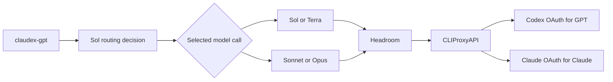
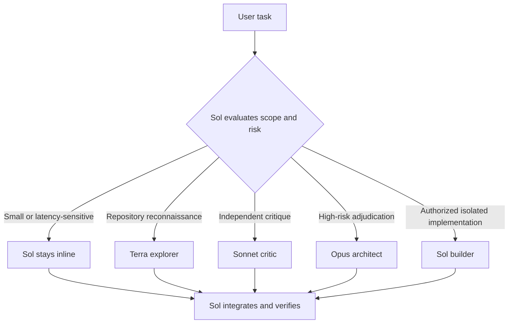
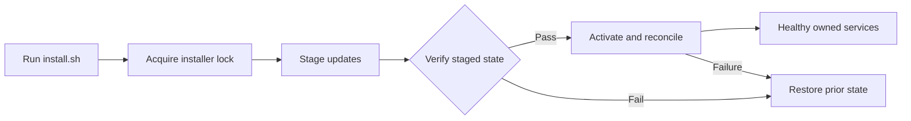
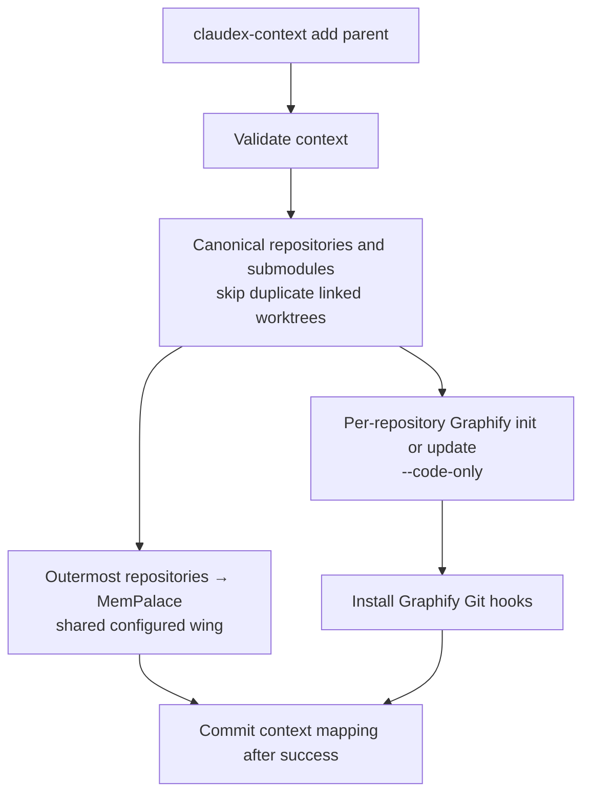
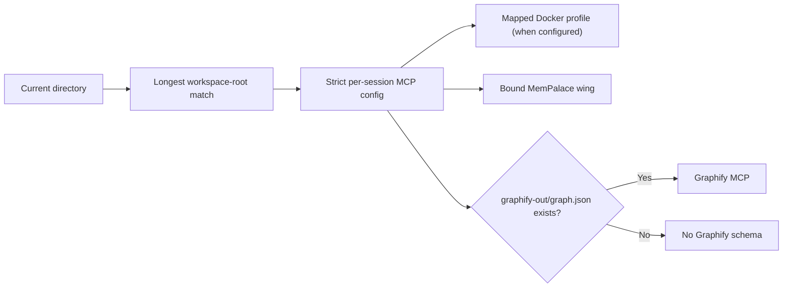

# Claudex workflow

A portable Claude Code daily driver that combines GPT and Claude models in one automatically routed, high-effort workflow.

**Supported:** macOS 13+ · glibc Linux · WSL2 with systemd

## Why use it

- **One entry point:** `claudex-gpt` starts the isolated controller and its project-aware tools.
- **Automatic delegation:** Sol stays inline for ordinary work and selects bounded specialists only when they materially improve the result.
- **Project-aware MCPs:** Docker MCP, MemPalace, and Graphify are exposed only when the current workspace needs them.
- **Repeatable upgrades:** `./install.sh` stages and verifies workflow-owned updates before activation, with rollback on a failed transaction.

## How a request flows

Every GPT and Claude model call passes through Headroom and CLIProxyAPI. Headroom runs with `--lossless` and `--code-aware`; `HEADROOM_OUTPUT_SHAPER=0`, `HEADROOM_VERBOSITY_AUTOTUNE=0`, and `HEADROOM_EFFORT_ROUTER=0` prevent it from lowering effort, reshaping output, or truncating workers.



<details>
<summary>Plain-text flow</summary>

```text
claudex-gpt
  -> Sol routing decision
  -> selected model call: Sol (gpt-5.6-sol) | Terra (gpt-5.6-terra) | Sonnet (claude-sonnet-5) | Opus (claude-opus-4-8)
  -> Headroom
  -> CLIProxyAPI
     -> Codex OAuth (GPT)
     -> Claude OAuth (Claude)
```

</details>

`gpt-5.6-sol` is the controller, normal writer, integrator, and final verifier. CLIProxyAPI routes each selected model to its configured provider login.

## What happens automatically

You describe the task normally; workflows are not manually invoked. High effort stays enabled, while delegation remains selective to avoid unnecessary token use.



| Path | Model | Purpose and authority |
| --- | --- | --- |
| Sol controller | `gpt-5.6-sol` | High-effort controller and normal writer; works inline by default. |
| Terra explorer/verifier | `gpt-5.6-terra` | Bounded read-only repository reconnaissance or independent verification. |
| Sonnet critic | `claude-sonnet-5` | Bounded read-only model-diverse correctness and regression criticism. |
| Opus architect | `claude-opus-4-8` | Reserved for high-risk read-only adjudication of security, authentication, concurrency, migration, irreversible architecture, or conflicting evidence. |
| `sol-builder` | `gpt-5.6-sol` | Isolated implementation only with explicit authorization, a written plan, a clean committed baseline, and an exact disjoint path boundary. |

Heavy investigation and review workflows activate only for independent parallel investigations, repeated analysis across at least eight items, or a high-impact cross-check. They use bounded output schemas, never nest delegation, and report degraded or missing specialists instead of silently retrying.

Bundled skills and Ultracode are disabled. Frontend Design is included locally and loaded only for new UI or material visual redesigns.

## Install and upgrade

Required: Claude Code, `curl`, `jq`, `git`, Python 3.10+, `rg`, `tar`, and `uv`. Docker with Docker MCP Toolkit is optional unless a workspace uses a Docker profile.

```bash
git clone https://github.com/arvind9981/claudex-workflow.git
cd claudex-workflow
./install.sh
claudex-login codex
claudex-login claude
./discover-models.sh
claudex-doctor
```

The installer resolves current Claudex and CLIProxyAPI releases, verifies their published SHA-256 digests, installs Headroom into the workflow's private data directory, upgrades the user-level MemPalace and Graphify tools through `uv`, synchronizes declared Claude Code plugins, and reconciles workflow-owned services. MemPalace and Graphify must complete real MCP initialization and expose the controller's required tools before installation can succeed. The installer does not patch any upstream package source or installed package file.

To update an existing checkout:

```bash
git pull --ff-only
./install.sh
```

The installer is safe to rerun. An upgrade can restart a changed or unhealthy owned service and may interrupt active Claudex sessions, so finish those sessions first.

Defaults are CLIProxyAPI `8317` and Headroom `8787`. A healthy service is reused only when its service definition and workflow data paths prove that Claudex owns it. If an unrelated listener occupies a requested port, an interactive installation shows the collision and prompts with the next available port. Non-interactive installations fail with an explicit override:

```bash
CLAUDEX_CLIPROXY_PORT=18317 CLAUDEX_HEADROOM_PORT=18787 ./install.sh
```

The selected pair is saved privately in `service-ports.json` under `CLAUDEX_DATA_DIR` and used by every launcher, generated configuration, health hook, discovery command, and diagnostic. Unknown service files and unrelated Headroom or CLIProxyAPI processes are never stopped or overwritten.

### Upgrade transaction

Installer runs are serialized. Staged binaries, generated model mappings, service definitions, and upgraded Python tools are verified before active state is replaced.



Unchanged healthy services remain running. Before a Headroom cutover, the private runtime must become healthy on an unused loopback port, so cold initialization happens while the existing proxy still serves traffic. Headroom uses the workflow-specific `com.user.claudex-headroom` LaunchAgent on macOS or `claudex-headroom.service` on systemd. A legacy generic Headroom service is migrated only when its configuration and state paths match this workflow exactly. If activation fails, the installer restores the previous owned service and private package state; it exits nonzero if recovery cannot be proven healthy. CLIProxyAPI binary, configuration, service activation, and endpoint state use the same transactional boundary.

After success, the **Installation locations** summary prints the checkout, data directory, launcher links, actual runtime binaries, service files, selected ports, and whether each service was installed, migrated, reconciled, or reused.

Normal `HUP`, `INT`, and `TERM` interruptions release owned locks. An uncatchable `SIGKILL` can leave model publication fail-closed; inspect the exact `model-config/publication.lock` or `model-config/endpoint.lock` under the workflow data directory before removing it manually.

There are no background auto-updaters and no repository-managed version pins. Rerun the installer whenever you want current compatible releases.

## Daily use

```bash
claudex-gpt          # GPT controller with bounded GPT and Claude specialists
claude-headroom      # native Claude Code through Headroom
claudex-doctor       # configuration, dependency, model, and service checks
```

Inside `claudex-gpt`, `/model opus` selects `claude-opus-4-8`; `/model gpt-5.6-sol` returns to Sol. Do not set `CLAUDE_CODE_SUBAGENT_MODEL` globally—the controller owns specialist selection.

## Manage Claudex plugins

Claudex plugins are declared once in `controller/plugins.json` and installed in
the workflow's isolated Claude configuration. The declaration is portable;
marketplace checkouts, plugin packages, configuration, and credentials remain
private under `CLAUDEX_DATA_DIR/claude-config`.

```bash
# The first plugin from a marketplace declares its portable source.
claudex-plugin add github@claude-plugins-official \
  --source anthropics/claude-plugins-official

# Later plugins from the same marketplace do not need --source.
claudex-plugin add another-plugin@claude-plugins-official

claudex-plugin list
claudex-plugin sync       # install missing plugins and upgrade existing ones
claudex-plugin update     # explicit alias for sync
claudex-plugin remove github@claude-plugins-official
```

`add` validates and atomically updates the repository declaration before
synchronizing the isolated installation. `remove` targets only the exact
declared plugin. `sync` registers or updates marketplaces, installs missing
plugins, updates installed plugins to the marketplace's current release, and
enables them. It does not silently uninstall undeclared machine-local plugins.
An empty declaration performs no network work.

Every `./install.sh` run performs the same sync, so a fresh clone converges and
later installer runs upgrade declared plugins without repository version pins.
Plugin code itself is never modified. Review a plugin before declaring it:
always-loaded skills, hooks, agents, and schemas can increase token usage or
change session behavior. All installed plugin agents remain subject to the
orchestration allowlist, and plugin-provided MCP servers remain subject to
strict per-session MCP configuration.

## Manage workspace contexts

Map a top-level parent such as `~/xebia` or `~/complion` once; every repository below it inherits that mapping. The parent itself does not need to be a Git repository.

```bash
claudex-context list
claudex-context add ~/work/acme --docker acme
claudex-context add ~/work/no-docker
claudex-context populate ~/work/acme
claudex-context update ~/work/acme --docker acme-prod --wing production
claudex-context remove ~/work/acme       # prompts for REMOVE
claudex-context remove ~/work/acme --yes
claudex-context validate
```

`add` requires an existing root. `--docker` is optional; when omitted, Docker MCP is not added to that project's strict session configuration. Unless overridden, `add` creates `~/.mempalace/palaces/<root-name>` with `<root-name>` as the wing. It validates first, mines each outermost canonical repository into the configured MemPalace wing, initializes or updates code-only Graphify in every current repository and submodule, installs Graphify Git hooks, and commits the mapping only after success. If no Git repository exists, MemPalace mines the configured root. Context mutations are locked and written atomically; duplicate, overlapping, symlinked, or unsafe paths are rejected before filesystem changes.

`populate` is the explicit, idempotent refresh for repositories cloned later. It uses Graphify `--code-only`; Graphify Git hooks then maintain current code after Git events. MemPalace is not mined on every commit, and population does not run as a service. During MemPalace mining, the workflow excludes `graphify-out/` in memory so generated graphs are not embedded back into project memory. It does not create or edit project ignore files or patch MemPalace. Existing contexts should run `claudex-context populate ~/work/acme` once after upgrading to this feature.

Repository identity comes from Git's common directory, not just its filesystem path. Discovery skips linked worktrees when their primary checkout is already in the context root, preventing the same repository from being mined and graphified twice. A linked worktree remains eligible when it is the only checkout inside the configured root; if several linked checkouts are present without the primary, one deterministic checkout represents the repository. Real submodules remain separate repositories.

Keep linked worktrees beside canonical repositories, as in `parent/.worktrees/repository-branch`, rather than inside a repository that MemPalace must scan. MemPalace has no dynamic CLI exclusion flag, so a skipped worktree nested inside a canonical memory source aborts before MemPalace starts. This fail-closed guard avoids duplicate drawers without editing the project's `.gitignore`, `mempalace.yaml`, or upstream package code.

Repository discovery and elapsed heartbeats are visible by default; there is
no `--verbose` mode to enable. Long operations identify their source, palace,
wing, repository, planned action, and elapsed time, followed by graph and hook
verification:

```text
[discover] found 2 repositories
[discover] skipped linked worktree api-fix — same repository as api
[mempalace 1/2] mining /home/me/work/acme/api into /home/me/.mempalace/palaces/acme; wing acme
[mempalace 1/2] mining — 00:10 elapsed
[graphify 1/2] updating api
[graphify 1/2] graph validated
[graphify 1/2] hooks installed and verified
```

Successful upstream tool output remains captured so project content does not
spill into the terminal. A failed tool still returns its bounded diagnostic
tail after the already completed stages.



The normal `claudex-gpt` session-routing flow below is unchanged.

The bounded legacy migration is dry-run by default and never deletes its source:

```bash
python3 integrations/mempalace_migration.py
python3 integrations/mempalace_migration.py --execute
```

It is intentionally specific to the approved Xebia and Complion split. It validates source and destination identities, rejects aliases or unsafe targets, and resumes item-by-item after a partial target write without duplicates.

## Project MCP behavior

Start `claudex-gpt` anywhere below a registered workspace root. The longest matching root determines the project context, and the launcher generates a strict MCP configuration for that session only.



- **Docker MCP** runs the mapped `docker mcp gateway` profile when one is configured. Normal create, update, comment, delete, and transition tools remain available; Claude Code permissions still govern writes.
- **MemPalace** is bound to the verified palace and wing for that workspace. The controller consults it when durable decisions or project conventions matter rather than loading memory for every request.
- **Graphify** is exposed only when the current Git repository has `graphify-out/graph.json` and `graphify-mcp` is installed. Its official Git hook is checked automatically before the session.

No matching workspace context means project-specific Docker MCP and MemPalace are not added. Normal Claude configuration is never edited globally.

## State and safety

OAuth credentials, downloaded binaries, generated configuration, model generation, logs, and private session state live outside the checkout under `CLAUDEX_DATA_DIR`, or by default:

```text
${XDG_DATA_HOME:-$HOME/.local/share}/claudex-workflow
```

`claudex-gpt` uses an isolated `CLAUDE_CONFIG_DIR`, so normal Claude settings, plugins, and claude.ai login configuration are not replaced. Declared plugin packages remain in the isolated configuration rather than the checkout. Headroom's executable and Python environment live below `CLAUDEX_DATA_DIR/headroom`; existing global Headroom installations are left untouched. LaunchAgent and systemd service definitions live in their OS configuration directories.

The repository stores no credentials, generated archives, project memories, or Graphify graphs. There are no persistent backups. Destructive, production, authentication, and other high-impact external writes still require explicit authority.

## Diagnose, test, and rollback

Run `claudex-doctor` after installation or when a dependency, generated configuration, service, project context, strict MCP fixture, or controller contract needs checking. The doctor performs disposable MemPalace and Graphify MCP handshakes and a non-billable Headroom-to-CLIProxyAPI routing check. Run `claudex-context validate` after manually editing context configuration.

Paid provider requests never run during installation. Trigger them explicitly when you want end-to-end validation:

```bash
./smoke-test.sh gpt
./smoke-test.sh claude
./smoke-test.sh controller
```

`./rollback.sh` disables only the workflow-owned `claudex-gpt` launcher link. It retains credentials, services, package data, project files, MemPalace data, and Graphify graphs.

## Upstream projects

- [CLIProxyAPI](https://github.com/router-for-me/CLIProxyAPI)
- [Claudex](https://github.com/StringKe/claudex)
- [Claudex documentation](https://claudex.space/en/)
- [Headroom](https://github.com/chopratejas/headroom)
- [MemPalace](https://github.com/MemPalace/mempalace)
- [Graphify](https://github.com/Graphify-Labs/graphify)
