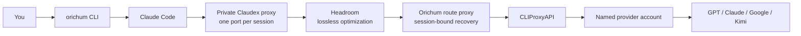
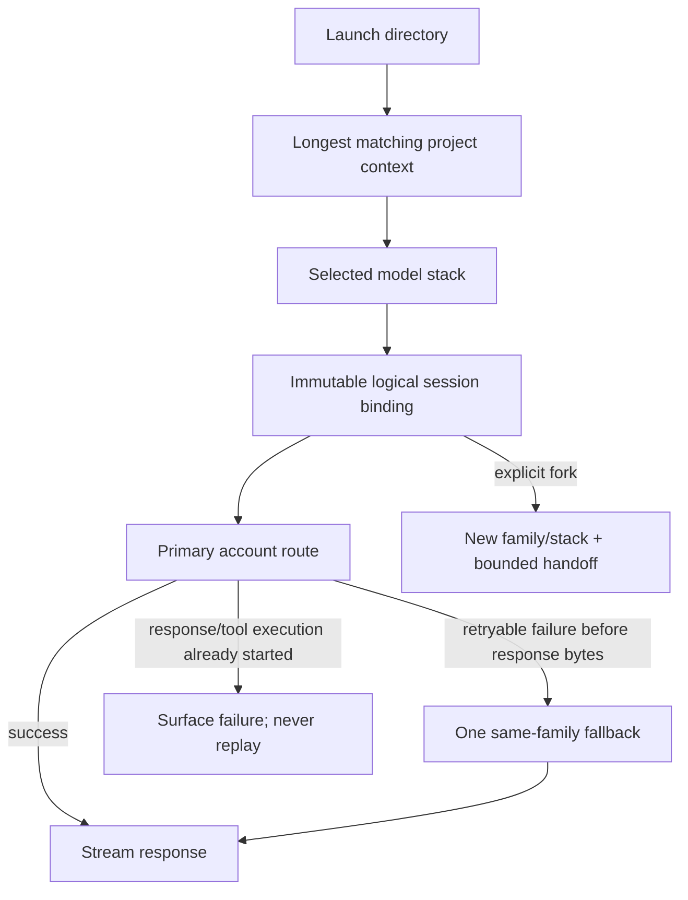
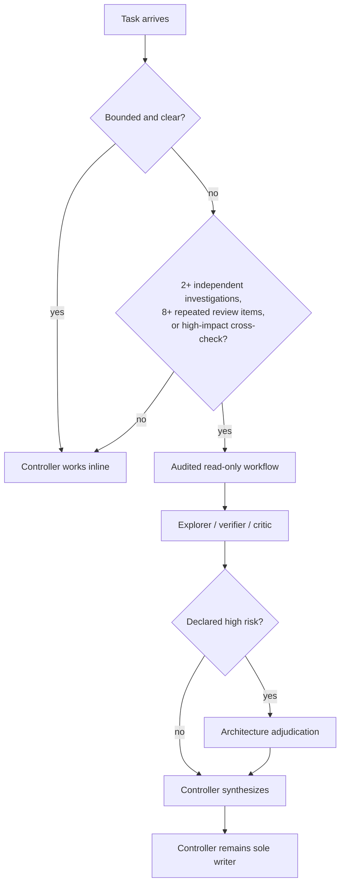

# Orichum

> One local control plane for Claude Code, multiple model families, multiple
> accounts, project-aware tools, and token-efficient subagents.

Orichum keeps Claude Code as the interactive shell while letting each session
use a validated model stack instead of one hard-coded provider. The controller,
specialists, account order, project tools, memory, and recovery rules are
declared in small JSON files. The command you use is simply:

```bash
orichum
```

The default stack is deliberately strong without using ultra effort:

- high-effort controller;
- cheaper read-only explorers and verifiers where appropriate;
- specialized critics and architects only when the task justifies them;
- one writer at a time;
- automatic same-family account recovery;
- explicit cross-family session handoff;
- lossless structural and code-aware Headroom compression, with Kompress ML,
  cache, memory, effort routing, and output shaping disabled.

## Installation

### Supported systems

- macOS on Apple Silicon or x86-64
- Linux on arm64 or x86-64 with a systemd user manager
- WSL2 with systemd enabled

Required commands: `bash`, `curl`, `gh`, `git`, `jq`, a bootstrap `python3`
3.10+, `rg`, `tar`, `uv`, and Claude Code. Linux and WSL also require `ss`,
normally provided by `iproute2`. The host Python is used only to begin the
installer; installed Orichum commands and services run on an isolated
uv-managed CPython 3.14.x. Authenticate every GitHub account referenced by
`projects.json` with `gh auth login` before installation.

### Install or upgrade

```bash
git clone https://github.com/arvind9981/claudex-workflow.git orichum
cd orichum
./install.sh
```

Every installer run is an upgrade and reconciliation pass. It:

1. validates the control plane and controller plugin;
2. installs or upgrades the newest CPython 3.14 patch under Orichum's data
   directory, preserving the previous patch for transactional recovery;
3. installs or upgrades CLIProxyAPI, Claudex, Headroom, Mempalace, and
   Graphify without pinning them to an old release;
4. verifies required CLIProxyAPI management behavior in an isolated probe;
5. creates or reconciles three Orichum-owned resident loopback services and
   validates the private Claudex proxy used by each session;
6. preserves valid existing configuration and authentication;
7. runs `orichum doctor` and prints every binary, Python runtime, data
   directory, service definition, and selected port.

Linux and WSL services log to the user journal. Inspect them with:

```bash
journalctl --user -u orichum-headroom.service
journalctl --user -u orichum-cliproxy.service
journalctl --user -u orichum-route-proxy.service
```

If a preferred resident-service port belongs to an existing Orichum service,
that service is reconciled and reused. If an unknown process owns it, Orichum
does not replace the process: an interactive install offers another port, while
a non-interactive install selects the next available port. Each session also
reserves its own Claudex translation-proxy port from a persisted preferred
starting point. This keeps simultaneous sessions isolated without installing a
fourth resident service.

Default locations:

| Purpose | Location |
|---|---|
| Command | `~/.local/bin/orichum` |
| Editable configuration | `~/.config/orichum/` |
| Binaries, auth, logs, service state | `~/.local/share/orichum/` |
| Managed CPython versions | `~/.local/share/orichum/python/` |
| Stable private Python | `~/.local/share/orichum/bin/orichum-python` |
| Logical session state | `~/.local/share/orichum/state/` |

Use `ORICHUM_CONFIG_HOME`, `ORICHUM_DATA_HOME`, and `ORICHUM_CACHE_HOME` to
relocate them. Logical session state always lives under
`$ORICHUM_DATA_HOME/state` so the CLI and route service cannot diverge. Paths
must be absolute.

Re-running the installer upgrades Python only within the 3.14 line. It never
changes Homebrew Python, distribution Python, global symlinks, shell profiles,
or another project's environment. Mempalace, Graphify, and Headroom retain
their own separate `uv tool` environments.

Verify the finished installation:

```bash
orichum doctor
orichum config paths
```

### Authenticate providers and name accounts

CLIProxyAPI performs provider login. Orichum then gives each credential a
stable display name, account pool, and priority.

```bash
orichum provider login codex
orichum provider login claude
orichum provider login antigravity
orichum provider login kimi

orichum config paths
ls ~/.local/share/orichum/auth

orichum provider account add \
  "Personal GPT" openai CREDENTIAL_FILE shared --priority primary

orichum provider account add \
  "Work Claude" anthropic CREDENTIAL_FILE xebia --priority 100

orichum provider accounts
```

Priority aliases are `primary` (100), `secondary` (50), and `reserve` (10);
integers from 0 through 1000 are also accepted.

```bash
orichum provider account priority ACCOUNT_ID secondary
orichum provider account rename ACCOUNT_ID "Work reserve"
orichum provider account disable ACCOUNT_ID
orichum provider account enable ACCOUNT_ID
orichum provider account remove ACCOUNT_ID
orichum provider account sync
```

Account names are shown only by the explicit account-management command.
Credential filenames, routing prefixes, tokens, and secrets are never printed
there.

## Usage

### Add a project context

A context maps a parent directory to its model stack, account pools,
MCP_DOCKER profile, Mempalace palace/wing, and repositories.

```bash
orichum context add ~/xebia \
  --docker xebia --github-account athevar-xebia
orichum context add ~/complion \
  --docker realtime --github-account arvind9981
orichum context add ~/personal --pool shared
```

`context add` is intentionally a one-time foreground operation. It:

- discovers a Git repository at the root or all independent repositories below
  it;
- follows declared Git submodules;
- skips duplicate linked worktrees of the same repository;
- mines each repository into the selected Mempalace wing;
- creates or updates Graphify graphs;
- installs and verifies Graphify's Git hooks;
- commits the project mapping only after population succeeds.

Progress and elapsed time are visible by default. It is not installed as a
background indexing service.

```bash
orichum context list
orichum context validate
orichum context populate ~/xebia
orichum context update ~/personal \
  --pool shared --no-docker --github-account arvind9981
orichum context remove ~/personal       # asks for REMOVE
orichum context remove ~/personal --yes
```

Run `context populate` again only when repositories were added after the
context was created, or when you explicitly want a full refresh. Normal Git
changes are maintained by the installed Graphify hooks.

When a context names a GitHub account, Orichum derives a private,
account-specific `GH_CONFIG_DIR` from an existing `gh auth` login. Each session
uses its own isolated configuration, so concurrent work and personal sessions
do not change the machine-wide active account.

### Start, resume, and fork sessions

From any repository below a configured project root:

```bash
orichum
orichum --permission-mode acceptEdits
```

Orichum chooses the project, stack, account pool, controller, and subagent
models automatically. You do not manually invoke the light or heavy workflow.

```bash
orichum sessions
orichum session routes SESSION_ID
orichum sessions routes SESSION_ID
orichum resume oc-s-0123456789abcdef
```

Resume preserves the original logical model/account binding and Claude session
identity. The current control plane and live services are validated again, but
the session is not silently moved to another model family.

To change family or stack, first list the stacks that are actually configured,
then create an explicit child session:

```bash
orichum models stacks
orichum fork oc-s-0123456789abcdef \
  --stack TARGET_STACK \
  --handoff-file ./bounded-handoff.md
```

`TARGET_STACK` must be one of the names shown by `orichum models stacks`.
The parent stays resumable. The child receives only the explicit bounded
handoff, not a replay of hidden provider state.

### Models and plugins

```bash
orichum models list
orichum models stacks
orichum models resolve
orichum models resolve STACK
orichum models validate

orichum plugin list
orichum plugin add PLUGIN@MARKETPLACE --source OWNER/REPOSITORY
orichum plugin update
orichum plugin sync
orichum plugin remove PLUGIN@MARKETPLACE
```

Plugins are declared in `plugins.json` and synchronized into Orichum's private
Claude configuration. The bundled `orichum-controller` plugin is always copied
into each immutable physical session; it is not managed as an optional plugin.

## Architecture

### Request path



All endpoints bind to `127.0.0.1`. CLIProxyAPI, Headroom, and the Orichum route
proxy are resident services. The Claudex translation proxy is owned by one
physical session and stops with that session. Before launch, Orichum verifies
the resident service definitions, loaded targets, owning processes, loopback
listeners, health endpoints, and live model catalogue. Session startup then
checks its private Claudex proxy as well. The route proxy also attests its exact
upstream CLIProxyAPI connection before forwarding request data.

### Session and failover flow



Same-family recovery is automatic and invisible, but tightly bounded:

- only a fallback already frozen into that logical session is eligible;
- one retry is allowed;
- retries stop once response bytes or tool execution may have started;
- invalid route configuration fails closed; an account-level authentication or
  quota failure can use only the session's one preselected fallback;
- cooldowns avoid repeatedly hitting a failing primary route.

This makes multiple concurrent Orichum sessions safe: every request carries its
own logical session ID, so one session cannot borrow another session's route.

### Automatic subagent policy



Generic agent and arbitrary workflow calls are denied. The controller chooses
the audited workflow automatically. This preserves subagent strength while
avoiding routine fan-out and transcript duplication.

### Project-aware MCPs

Each physical session receives a private, minimal MCP file:

| MCP | Loaded when | Purpose |
|---|---|---|
| MCP_DOCKER | Project has a Docker profile | Project-specific Jira and other live tools, including writes subject to normal tool approval |
| Mempalace | Palace exists and passes ownership/mode checks | Recall durable project decisions without remaking the project every session |
| Graphify | Current Git repository has a valid graph | Query code structure before broad raw search |

Mempalace calls are constrained to the resolved project palace and wing.
Graphify output is excluded from Mempalace mining to avoid embedding generated
graph data back into memory.

### Control plane

Orichum exposes these focused files as one strictly validated configuration:

| File | Controls |
|---|---|
| `model-stacks.json` | Logical models, families, upstream IDs, controller, and role candidates |
| `providers.json` | Provider adapters, auth types, account pools, and same-family fallback order |
| `projects.json` | Parent-directory context, stack override, account pools, GitHub account, MCP_DOCKER profile, Mempalace |
| `plugins.json` | Optional Claude marketplaces and plugins |
| `runtime.json` | Controller effort and tool/subagent concurrency |
| `controller-policy.md` | Sole-writer, delegation, memory, graph, and attribution policy |
| `accounts.json` | Private named-account registry managed by `orichum provider account` |

Edit the installed copies shown by `orichum config paths`, then validate:

```bash
orichum config validate
orichum models resolve
orichum context list
```

Adding Kimi, Google/Antigravity, another Claude source, or a future
OpenAI-compatible model does not require changing Orichum code. Declare the
provider/family route, model metadata, and stack candidates in the focused
files, authenticate the provider, and register the named account.

## References

- [CLIProxyAPI](https://github.com/router-for-me/CLIProxyAPI)
- [Claudex](https://claudex.space/en/)
- [Claude Code LLM gateway configuration](https://docs.anthropic.com/en/docs/claude-code/llm-gateway)
- [Headroom](https://github.com/chopratejas/headroom)
- [Mempalace](https://github.com/MemPalace/mempalace)
- [Graphify](https://github.com/Graphify-Labs/graphify)

Orichum does not patch the source code of these projects. Integrations live in
this repository and can be removed or upgraded independently.
