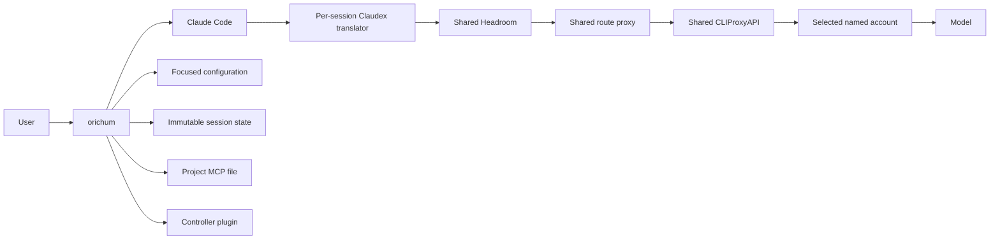

# Architecture

## Components

CLIProxyAPI, Headroom, and the route proxy are resident services bound to
`127.0.0.1`. Each physical session owns one Claudex translator, private run
directory, MCP file, and materialized controller plugin.

## Launch sequence

1. Resolve the longest matching project context.
2. Validate the focused configuration and project resources.
3. Discover live provider/model routes and select eligible accounts.
4. Freeze the logical session route and integrity digests.
5. Materialize the controller plugin and minimal MCP configuration.
6. Start and health-check the session's Claudex translator.
7. Launch Claude Code with the strict MCP file and controller policy.

Resume revalidates the current control plane and services but keeps the logical
session's frozen route. Fork creates a new binding and carries only a bounded
handoff.

## Boundaries

- All network services are loopback-only.
- Session files and account registries use private ownership and modes.
- Context and model files are digest-bound to the physical run.
- GitHub configuration is copied into per-session account-specific state.
- MCP_DOCKER, Mempalace, and Graphify are included only when relevant.
- The controller is the sole writer; audited specialists are read-only.
- The route proxy performs at most one safe pre-output fallback.

Orichum integrates upstream projects without changing their source code.
