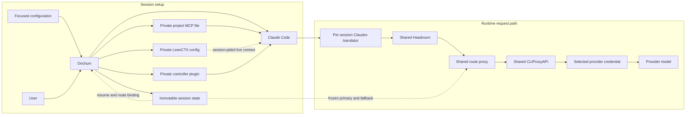
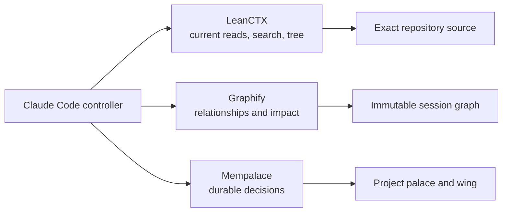
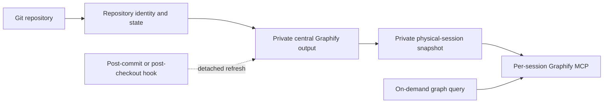

# Architecture

## Session setup and request path

CLIProxyAPI, Headroom, and the route proxy are resident services bound to
`127.0.0.1`. Each physical session owns one Claudex translator, private run
directory, MCP file, and materialized controller plugin.

Orichum gives the private MCP file and controller plugin to Claude Code when it
starts. The MCP file exposes only tools relevant to the resolved project. The
controller plugin supplies the controller policy, audited specialist roles,
workflows, and safety hooks.

## Context path

LeanCTX is a per-session headless stdio MCP, not a resident service. Orichum
pins it to the active Git repository, gives it private session-local storage,
and exposes only `ctx_read`, `ctx_search`, `ctx_tree`, and `ctx_expand`.
`ctx_call`, LeanCTX proxying, graph, memory, global hooks, shell interception,
and autonomous features are disabled. Native Claude Code reads and searches
remain available as the failure path and for exact verification.

## Launch sequence

1. Resolve the longest matching project context.
2. Validate the focused configuration and project resources.
3. Discover live provider/model routes and select eligible accounts.
4. Freeze the logical session route and integrity digests.
5. Materialize the controller plugin, minimal MCP configuration, and private
   LeanCTX contract when the launch is inside a Git repository.
6. Start and health-check the session's Claudex translator.
7. Launch Claude Code with the strict MCP file and controller policy.

Resume revalidates the current control plane and services but keeps the logical
session's frozen route. Fork creates a new binding and carries only a bounded
handoff.

## Runtime request path

1. Claude Code sends the model request through its per-session Claudex
   translator.
2. Claudex translates the Claude Code request for the session's selected model
   family.
3. Shared Headroom applies lossless structural and code-aware prompt
   optimization.
4. The shared route proxy reads the immutable session binding and selects its
   frozen primary route or, when safe, its one compatible fallback.
5. Shared CLIProxyAPI uses the selected provider credential to authenticate and
   forward the request to the provider model. The credential is routing and
   authentication data, not another running service.
6. The model response returns through the same components to Claude Code.

## Repository graph lifecycle

Clean repositories at the same commit share one revision graph even when their
clone paths differ. A dirty checkout uses a working graph keyed by its
persistent checkout identity and content fingerprint, so uncommitted states do
not leak between clones or linked worktrees. Graph nodes keep source paths
relative to the repository; generated output is stored below Orichum's private
data directory.

Session setup only accepts a central graph that already matches the exact
repository state. Each physical session securely copies those validated bytes
to its private `run_dir/graph.json`, records the digest in immutable context,
and points its MCP at that mode-`0600` snapshot. It never extracts or updates a
graph. A running physical session therefore stays on its graph generation even
when central storage changes. A resume or other new physical run snapshots the
then-current valid central graph, or omits Graphify when no stable match is
available. Graphify queries are made on demand through the bound MCP, and graph
commands do not invoke Mempalace.

## Boundaries

- All network services are loopback-only.
- Session files and account registries use private ownership and modes.
- Context and model files are digest-bound to the physical run.
- GitHub configuration is copied into per-session account-specific state.
- LeanCTX, MCP_DOCKER, Mempalace, and Graphify are included only when relevant.
- LeanCTX state and config are private to one physical session and never become
  a global hook, daemon, graph, memory store, or request proxy.
- Graphify output is central and private; repository-local output is legacy
  migration input, not active state.
- The controller is the sole writer; audited specialists are read-only.
- The route proxy performs at most one safe pre-output fallback.

Orichum integrates upstream projects without changing their source code.
