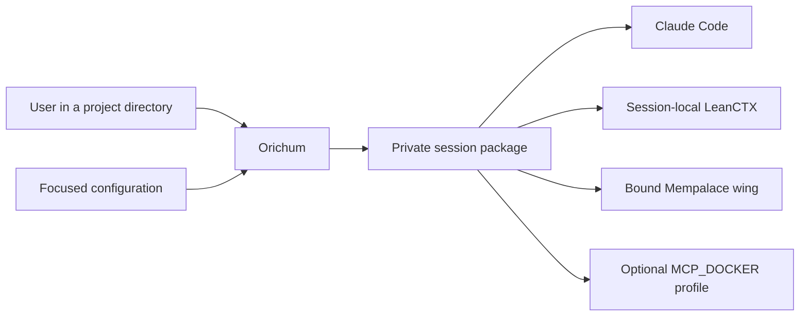
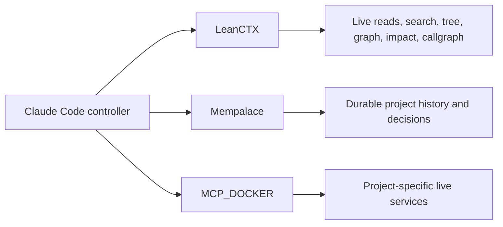
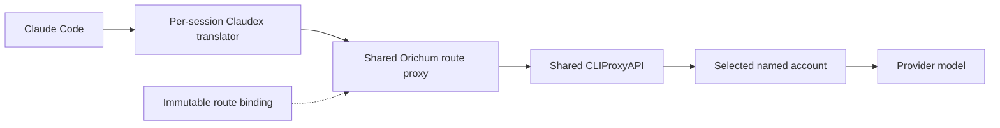

# Architecture

## Session creation

Orichum resolves the launch directory, selects the configured stack and
account, and materializes one private physical session. The session contains
immutable route state, a strict MCP file, the controller plugin, and a
project-jailed LeanCTX configuration.

## Context path

LeanCTX owns live code intelligence. Each physical session receives a private
headless MCP pinned to the active repository, or to the verified configured
parent when launched above several repositories. Its fixed surface is:

`ctx_read`, `ctx_search`, `ctx_tree`, `ctx_expand`, `ctx_graph`, `ctx_impact`,
`ctx_callgraph`, `ctx_patch`, and `ctx_shell`.

The graph and index are built lazily when a tool needs them. There is no
repository-local generated graph, global hook, shared graph daemon, or startup
indexing pass. Concurrent sessions keep independent LeanCTX state.

Mempalace remains the durable-memory layer. It is populated explicitly when a
project context is added or refreshed, and recalled only when prior decisions
or conventions matter. MCP_DOCKER is attached only when the resolved project
declares a profile.

## Launch sequence

1. Resolve the longest matching project context.
2. Validate configuration and project resources.
3. Discover live provider/model routes and select eligible accounts.
4. Freeze the logical session route and integrity digests.
5. Materialize the controller plugin, strict MCP file, and private LeanCTX
   contract.
6. Bind the verified project, Docker profile, GitHub account, and Mempalace
   wing in the controller policy.
7. Start and health-check the session's Claudex translator.
8. Launch Claude Code.

Resume revalidates services and creates a fresh physical package while
preserving the logical session route. Fork creates a new logical binding and
carries only a bounded handoff.

## Model request path

The route proxy selects the session's frozen primary route or one compatible
fallback. For verified request protocols, Orichum keeps the nine LeanCTX tools
resident and defers unrelated optional tool schemas. The model therefore sees
one deterministic code-context surface instead of choosing between overlapping
optimizers.

## Deterministic tool routing

| Need | Tool |
|---|---|
| Read, search, tree, or exact expansion | LeanCTX |
| Relationships, symbols, call paths, or change impact | LeanCTX graph tools |
| Anchored supported text edit | `ctx_patch` |
| Observational shell output | `ctx_shell` |
| Git, package, service, deployment, or other state change | Native `Bash` |
| Unsupported or binary file operation | Native file tools |
| Durable history or prior decisions | Mempalace |
| Project live services | MCP_DOCKER |

Native tools remain a fallback, not a second optimizer. `ctx_patch` and
`ctx_shell` retain Claude Code's normal approval behavior.

## Boundaries

- Network services listen on loopback only.
- Session files and account registries are private and digest-bound.
- LeanCTX cache, index, graph, and configuration are private to one physical
  session.
- The controller is the sole writer; specialist agents follow the configured
  bounded policy.
- The route proxy performs at most one safe pre-output fallback.

Orichum integrates upstream projects without modifying their source code.
