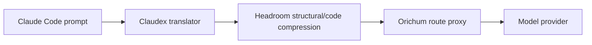

# Headroom

Headroom sits in the request path between each session's Claudex translator and
the Orichum route proxy. It reduces repeated prompt material before the request
reaches the selected provider.

LeanCTX operates on a different path: it supplies compact current-source
context through a per-session MCP. Orichum does not enable the LeanCTX request
proxy, so Headroom remains the only wire/request compressor.

Orichum enables lossless structural and AST-aware code compression. Kompress
ML, cache, Headroom memory, effort routing, and output shaping are disabled.
Those features either duplicate Orichum responsibilities or can change
semantics; Headroom remains useful through its deterministic compression.



## Inspect

```bash
orichum headroom status
orichum doctor
headroom perf
```

Use `headroom perf` or live proxy statistics to evaluate savings. Prompt size
alone does not prove compression savings.

Headroom is one resident loopback service shared by sessions. Per-session
Claudex translators remain separate because they carry physical session
protocol state. The installer owns Headroom's private uv environment,
configuration, service definition, and port reconciliation.
