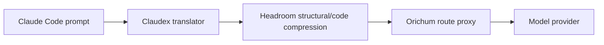

# Headroom

Headroom sits in the request path between each session's Claudex translator and
the Orichum route proxy. It reduces repeated prompt material before the request
reaches the selected provider.

LeanCTX operates earlier on a different path: it compacts source and
observational shell output before those results enter the conversation.
Headroom then covers the complete request, including native tools, Graphify,
Mempalace, MCP_DOCKER, conversation history, and other prompt material.
Orichum does not enable the LeanCTX request proxy, so Headroom remains the only
wire/request compressor.

Orichum enables lossless structural and AST-aware code compression. Kompress
ML, cache, Headroom memory, effort routing, and output shaping are disabled.
Those features either duplicate Orichum responsibilities or can change
semantics; Headroom remains useful through its deterministic compression.



## Inspect

```bash
orichum headroom status
orichum doctor
bin/orichum-headroom perf --hours 24
```

The repository wrapper points `perf` at Orichum's private Headroom state. Use
those managed proxy statistics to evaluate savings; prompt size alone does not
prove compression savings. Recent lossless no-ops are not enough to remove
Headroom: reassess after at least seven representative days or 100 model
requests and compare marginal savings, latency, and failures.

Headroom is one resident loopback service shared by sessions. Per-session
Claudex translators remain separate because they carry physical session
protocol state. The installer owns Headroom's private uv environment,
configuration, service definition, and port reconciliation.
