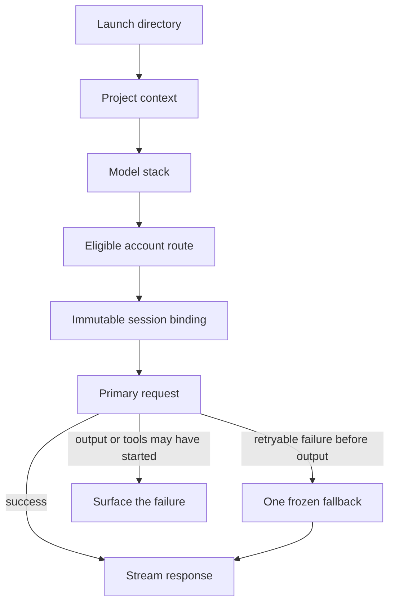

# Routing and failover

## Route selection

At session creation, Orichum combines:

1. the longest matching project context;
2. its selected model stack;
3. account pools visible to that project;
4. live provider and model routes;
5. account health, priority, and optional named-account locks.

The resulting logical session stores a primary route and no more than one
same-model, same-family account fallback.



## Recovery limits

- Recovery never selects an account that was not frozen into the session.
- Only one retry is allowed.
- The retry must keep the same logical model and family.
- No replay occurs after response bytes or tool execution may have started.
- Authentication or quota failure can use only the preselected fallback.
- Cooldowns stop repeated pressure on a failing primary.
- Invalid configuration fails closed.

Provider changes and family changes are explicit. Use `orichum fork` with a
target stack and bounded handoff; do not expect a running Claude controller to
change protocol transparently.

Inspect a frozen route with:

```bash
orichum session routes SESSION_ID
```
